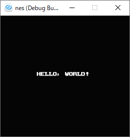
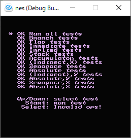
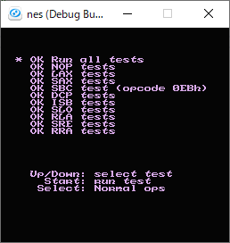
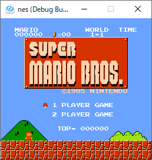
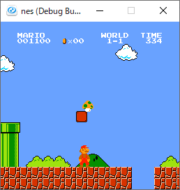
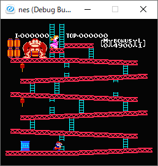
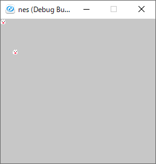
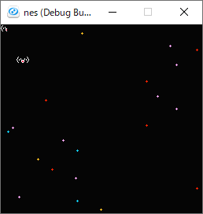
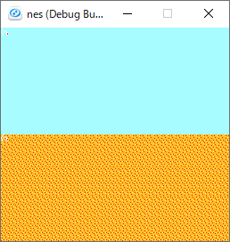
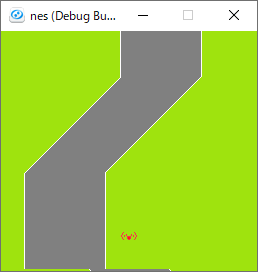

# これはなに
NES エミュレータを作ってみたかった

# ビルド方法
```
$ mkdir ./Outputs
$ cd Outputs 
$ cmake ..
$ cmake --build .
```
# 動かしてみる
EmotionalEngine-NES は NES エミュレータのロジック部分のみを提供するライブラリです。実際に nes を動作させて nes のソフトをプレイするにはライブラリをリンクしたフロントエンドの実装が必要になります。動作確認用のテストとして `testPpu_PpuGraphicwithUI` を添付してありますので、それを使って動かす手順をここに記述します。
## 動作環境  
Windows10 + Visual Studio 2019 で動作確認しています。  
`testPpu_PpuGraphicwithUI` は Siv3D 0.4.3 に依存しますので、あらかじめインストールしておく必要があります。
## ライブラリをビルドする
上記の ビルド方法 の通りにビルドします。ただし、 `CMakeLists.txt` のコメントアウトされている箇所 `#set(CMAKE_CXX_FLAGS_DEBUG "/MTd")` のコメントアウトを外しておきます。  
- `testPpu_PpuGraphicwithUI` のプロジェクトファイルが上記ビルド成果物に依存しているので、ビルドディレクトリの名前は `Outputs` にしてください。

## テストを実行する
- `Tests/Integrate/Graphic/testPpu_PpuGraphicwithUI/testPpu_PpuGraphicwithUI.sln` を Visual Studio 2019 で開きます。  
- `Tests/TestBinaries/` 以下に rom ファイルを置き、 `Tests/Integrate/Graphic/testPpu_PpuGraphicwithUI/Main.cpp` を参考にパスをハードコードします。(雑ですが、あくまでテストプログラムであるのでサボっています。)  
- Visual Studio からテストをビルドして実行すると、前手順で指定した rom が実行されます。  

## テストを実行する(DX ライブラリ版フロントエンド)
サウンドの再生は DX ライブラリ版のみサポートします。(wav のサンプル単位で再生する機能が 2022/2/1現在の Siv3D にはなかったため)  
- 上記の ビルド方法 の通りにビルドします。  
- Outputs/EmotionalNES.sln を Visual Studio 2019 で開き、testIntegrate_All をスタートアッププロジェクトに指定します。  
- `Tests/TestBinaries/` 以下に rom ファイルを置き、 `Tests/Integrate/All/testEmu.cpp` を参考にパスをハードコードします。(雑ですが、あくまでテストプログラムであるのでサボっています。)  
- Visual Studio からテストをビルドして実行すると、前手順で指定した rom が実行されます。  

# スクリーンショットたち  
- Hello World & nestest



- mario


- donkey


# ｷﾞｺ猫


# ディレクトリ構成
```
.
├── Include
├── Programs
│   └── src
├── Tests
│   └── TestBinaries
└── readme.md
```
## ./Include
EmotionalNES ライブラリの公開ヘッダーを格納します。
## Programs/src
EmotionalNES ライブラリのソースコードを格納します。とりあえずフラットに全部置きます。やばくなってきたら整理する……
# Tests
{単体, 統合}テストを格納します。適宜ディレクトリを切ることにします。
# Tests/TestBinaries
テスト用のバイナリを配置します。主に配布されている nes のテスト用 ROM を配置して、テストから参照します。

# 開発
PR 前に以下の手順でテストを実行して通ることを確認します。  
(ビルド方法 の手順が済んでいる前提)  
```
$ cd Outputs 
$ cmake --build .
$ ctest -C Debug
```

# 著作権表記
## DX ライブラリ関連
libjpeg　Copyright (C) 1991-2013, Thomas G. Lane, Guido Vollbeding.
this software is based in part on the work of the Independent JPEG Group


libpng　Copyright (C) 2004, 2006-2012 Glenn Randers-Pehrson.
zlib　Copyright (C) 1995-2012 Jean-loup Gailly and Mark Adler.


libtiff　Copyright (c) 1988-1997 Sam Leffler
libtiff　Copyright (c) 1991-1997 Silicon Graphics, Inc.

Permission to use, copy, modify, distribute, and sell this software and
its documentation for any purpose is hereby granted without fee, provided
that (i) the above copyright notices and this permission notice appear in
all copies of the software and related documentation, and (ii) the names of
Sam Leffler and Silicon Graphics may not be used in any advertising or
publicity relating to the software without the specific, prior written
permission of Sam Leffler and Silicon Graphics.

THE SOFTWARE IS PROVIDED "AS-IS" AND WITHOUT WARRANTY OF ANY KIND,
EXPRESS, IMPLIED OR OTHERWISE, INCLUDING WITHOUT LIMITATION, ANY
WARRANTY OF MERCHANTABILITY OR FITNESS FOR A PARTICULAR PURPOSE.

IN NO EVENT SHALL SAM LEFFLER OR SILICON GRAPHICS BE LIABLE FOR
ANY SPECIAL, INCIDENTAL, INDIRECT OR CONSEQUENTIAL DAMAGES OF ANY KIND,
OR ANY DAMAGES WHATSOEVER RESULTING FROM LOSS OF USE, DATA OR PROFITS,
WHETHER OR NOT ADVISED OF THE POSSIBILITY OF DAMAGE, AND ON ANY THEORY OF
LIABILITY, ARISING OUT OF OR IN CONNECTION WITH THE USE OR PERFORMANCE
OF THIS SOFTWARE.


libogg　Copyright (C) 2002-2009 Xiph.org Foundation

Redistribution and use in source and binary forms, with or without
modification, are permitted provided that the following conditions
are met:

- Redistributions of source code must retain the above copyright
notice, this list of conditions and the following disclaimer.

- Redistributions in binary form must reproduce the above copyright
notice, this list of conditions and the following disclaimer in the
documentation and/or other materials provided with the distribution.

- Neither the name of the Xiph.org Foundation nor the names of its
contributors may be used to endorse or promote products derived from
this software without specific prior written permission.

THIS SOFTWARE IS PROVIDED BY THE COPYRIGHT HOLDERS AND CONTRIBUTORS
``AS IS'' AND ANY EXPRESS OR IMPLIED WARRANTIES, INCLUDING, BUT NOT
LIMITED TO, THE IMPLIED WARRANTIES OF MERCHANTABILITY AND FITNESS FOR
A PARTICULAR PURPOSE ARE DISCLAIMED. IN NO EVENT SHALL THE FOUNDATION
OR CONTRIBUTORS BE LIABLE FOR ANY DIRECT, INDIRECT, INCIDENTAL,
SPECIAL, EXEMPLARY, OR CONSEQUENTIAL DAMAGES (INCLUDING, BUT NOT
LIMITED TO, PROCUREMENT OF SUBSTITUTE GOODS OR SERVICES; LOSS OF USE,
DATA, OR PROFITS; OR BUSINESS INTERRUPTION) HOWEVER CAUSED AND ON ANY
THEORY OF LIABILITY, WHETHER IN CONTRACT, STRICT LIABILITY, OR TORT
(INCLUDING NEGLIGENCE OR OTHERWISE) ARISING IN ANY WAY OUT OF THE USE
OF THIS SOFTWARE, EVEN IF ADVISED OF THE POSSIBILITY OF SUCH DAMAGE.


Opus audio codec
Copyright 2001-2011 Xiph.Org, Skype Limited, Octasic,
 Jean-Marc Valin, Timothy B. Terriberry,
 CSIRO, Gregory Maxwell, Mark Borgerding,
 Erik de Castro Lopo

Redistribution and use in source and binary forms, with or without
modification, are permitted provided that the following conditions
are met:

- Redistributions of source code must retain the above copyright
notice, this list of conditions and the following disclaimer.

- Redistributions in binary form must reproduce the above copyright
notice, this list of conditions and the following disclaimer in the
documentation and/or other materials provided with the distribution.

- Neither the name of Internet Society, IETF or IETF Trust, nor the
names of specific contributors, may be used to endorse or promote
products derived from this software without specific prior written
permission.

THIS SOFTWARE IS PROVIDED BY THE COPYRIGHT HOLDERS AND CONTRIBUTORS
``AS IS'' AND ANY EXPRESS OR IMPLIED WARRANTIES, INCLUDING, BUT NOT
LIMITED TO, THE IMPLIED WARRANTIES OF MERCHANTABILITY AND FITNESS FOR
A PARTICULAR PURPOSE ARE DISCLAIMED. IN NO EVENT SHALL THE COPYRIGHT OWNER
OR CONTRIBUTORS BE LIABLE FOR ANY DIRECT, INDIRECT, INCIDENTAL, SPECIAL,
EXEMPLARY, OR CONSEQUENTIAL DAMAGES (INCLUDING, BUT NOT LIMITED TO,
PROCUREMENT OF SUBSTITUTE GOODS OR SERVICES; LOSS OF USE, DATA, OR
PROFITS; OR BUSINESS INTERRUPTION) HOWEVER CAUSED AND ON ANY THEORY OF
LIABILITY, WHETHER IN CONTRACT, STRICT LIABILITY, OR TORT (INCLUDING
NEGLIGENCE OR OTHERWISE) ARISING IN ANY WAY OUT OF THE USE OF THIS
SOFTWARE, EVEN IF ADVISED OF THE POSSIBILITY OF SUCH DAMAGE.


Opusfile
Copyright (c) 1994-2013 Xiph.Org Foundation and contributors

Redistribution and use in source and binary forms, with or without
modification, are permitted provided that the following conditions
are met:

- Redistributions of source code must retain the above copyright
notice, this list of conditions and the following disclaimer.

- Redistributions in binary form must reproduce the above copyright
notice, this list of conditions and the following disclaimer in the
documentation and/or other materials provided with the distribution.

- Neither the name of the Xiph.Org Foundation nor the names of its
contributors may be used to endorse or promote products derived from
this software without specific prior written permission.

THIS SOFTWARE IS PROVIDED BY THE COPYRIGHT HOLDERS AND CONTRIBUTORS
``AS IS'' AND ANY EXPRESS OR IMPLIED WARRANTIES, INCLUDING, BUT NOT
LIMITED TO, THE IMPLIED WARRANTIES OF MERCHANTABILITY AND FITNESS FOR
A PARTICULAR PURPOSE ARE DISCLAIMED. IN NO EVENT SHALL THE FOUNDATION
OR CONTRIBUTORS BE LIABLE FOR ANY DIRECT, INDIRECT, INCIDENTAL,
SPECIAL, EXEMPLARY, OR CONSEQUENTIAL DAMAGES (INCLUDING, BUT NOT
LIMITED TO, PROCUREMENT OF SUBSTITUTE GOODS OR SERVICES; LOSS OF USE,
DATA, OR PROFITS; OR BUSINESS INTERRUPTION) HOWEVER CAUSED AND ON ANY
THEORY OF LIABILITY, WHETHER IN CONTRACT, STRICT LIABILITY, OR TORT
(INCLUDING NEGLIGENCE OR OTHERWISE) ARISING IN ANY WAY OUT OF THE USE
OF THIS SOFTWARE, EVEN IF ADVISED OF THE POSSIBILITY OF SUCH DAMAGE.


Mersenne Twister
Copyright (C) 1997 - 2002, Makoto Matsumoto and Takuji Nishimura,
All rights reserved.

Redistribution and use in source and binary forms, with or without
modification, are permitted provided that the following conditions
are met:

1. Redistributions of source code must retain the above copyright
notice, this list of conditions and the following disclaimer.

2. Redistributions in binary form must reproduce the above copyright
notice, this list of conditions and the following disclaimer in the
documentation and/or other materials provided with the distribution.

3. The name of the author may not be used to endorse or promote products
derived from this software without specific prior written permission.

THIS SOFTWARE IS PROVIDED BY THE AUTHOR ``AS IS'' AND ANY EXPRESS OR
IMPLIED WARRANTIES, INCLUDING, BUT NOT LIMITED TO, THE IMPLIED WARRANTIES
OF MERCHANTABILITY AND FITNESS FOR A PARTICULAR PURPOSE ARE DISCLAIMED.
IN NO EVENT SHALL THE AUTHOR BE LIABLE FOR ANY DIRECT, INDIRECT,
INCIDENTAL, SPECIAL, EXEMPLARY, OR CONSEQUENTIAL DAMAGES (INCLUDING, BUT
NOT LIMITED TO, PROCUREMENT OF SUBSTITUTE GOODS OR SERVICES; LOSS OF USE,
DATA, OR PROFITS; OR BUSINESS INTERRUPTION) HOWEVER CAUSED AND ON ANY
THEORY OF LIABILITY, WHETHER IN CONTRACT, STRICT LIABILITY, OR TORT
(INCLUDING NEGLIGENCE OR OTHERWISE) ARISING IN ANY WAY OUT OF THE USE OF
THIS SOFTWARE, EVEN IF ADVISED OF THE POSSIBILITY OF SUCH DAMAGE.


Bullet　Copyright (c) 2003-2006 Erwin Coumans.

## DX ライブラリの再配布に関して  
DX Library Copyright (C) 2001-2021 Takumi Yamada.